# BlueIPTV

An Android IPTV player built with React Native and Expo, targeting tablets and phones in
landscape. It connects to a user's own IPTV provider (an **Xtream Codes** account or a plain
**M3U playlist**), mirrors that provider's catalogue into on-device **SQLite**, and plays streams
through a patched **libVLC** backend.

The defining decision is that the app is **fully client-side**. There is no server, no accounts and
no third party between the device and the provider. An earlier revision used an Express + MongoDB +
S3 backend as a credential vault; it was deliberately deleted (see
[Architectural evolution](#architectural-evolution)).

**~6,650 lines across 28 source files**, plus a custom Kotlin native module, an Expo config plugin,
and two patches to an upstream library.

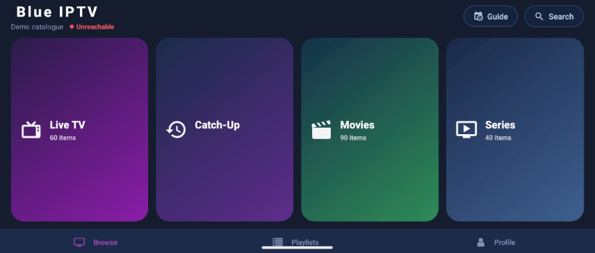

> All screenshots use the built-in demo catalogue, so every name is a placeholder. See
> [Demo mode](#demo-mode).

---

## Features

**Providers**
- Xtream Codes API and M3U/M3U8 playlists, chosen by segmented control in one form
- Multiple saved playlists, one active at a time; switching wipes and re-syncs so two providers' ID
  spaces never collide
- Subscription validated before anything is saved: credentials authenticated, `status` and
  `exp_date` evaluated, expired or banned accounts reported clearly rather than surfacing later as
  empty categories. Expiry within 7 days raises an advisory warning
- Installs from the previous single-account build migrate transparently on first launch

**Browsing**

Three-pane live TV: categories, channels, and a preview player with EPG. Single tap previews
inline, double tap goes fullscreen. Channels that a provider lists several times at different
qualities are grouped into one row with quality chips.

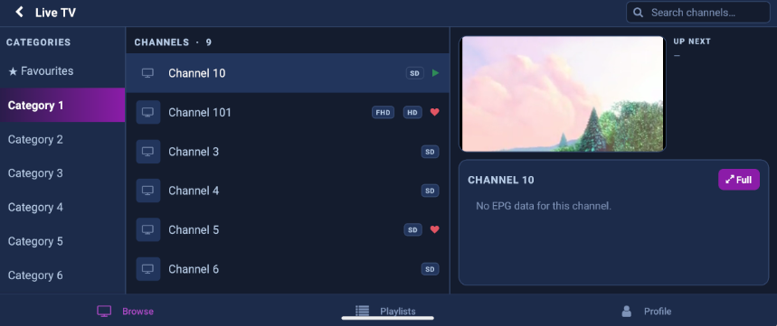

- **Browse**: fixed no-scroll landscape dashboard: gradient hero cards with live catalogue counts,
  a continue-watching rail, provider status in the header
- **Movies / Series**: self-measuring poster grid that fits exactly three rows at any screen size,
  with marquee-scrolling titles
- **Catch-Up TV**: replays already-aired programmes per channel and per day, where the provider
  exposes an archive
- **Favourites** and **Recently watched** as virtual first categories in each section
- Section-scoped and global search, sort (A–Z / newest / rating), and long-press to hide the junk
  categories some providers ship by the hundred

**Programme guide**

A scrollable now/next grid across channels and time slots, with catch-up available inline on
channels that support it.

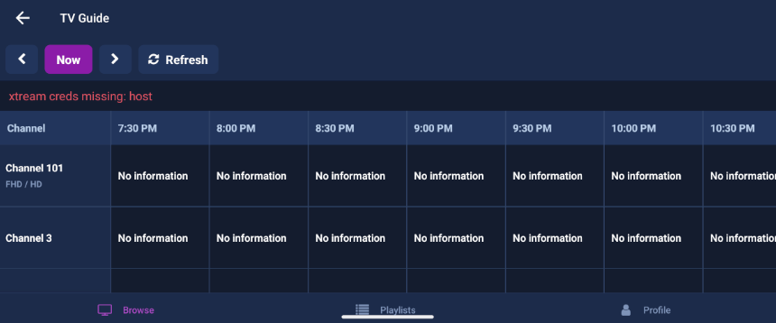

**Playback**

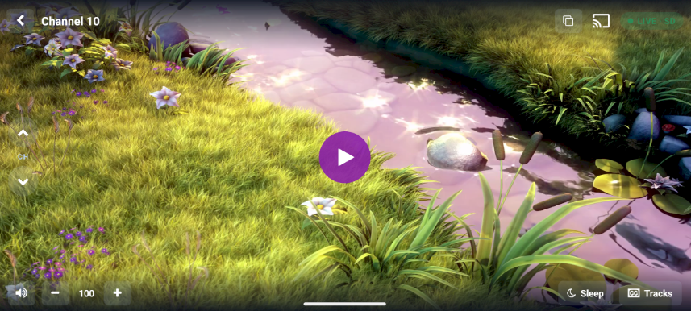

Custom overlay with auto-hide and tap-to-seek, hold-right-side for 2× speed, swipe-to-zap channels
within a category, next/previous episode across season boundaries, resume prompts, next-episode
autoplay, sleep timer, live quality switching, Chromecast, and picture-in-picture.

Subtitle and audio tracks are selectable from a slide-in panel, with a subtitle sync offset applied
live through a patched libVLC binding.

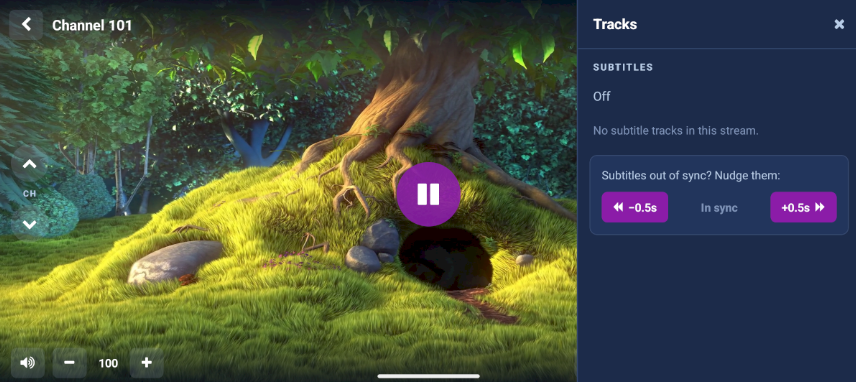

<details>
<summary><b>More screens</b>: login, playlists, movies, series, catch-up, profile</summary>

<br>

**Login.** One form for both provider types, with the demo catalogue offered underneath.

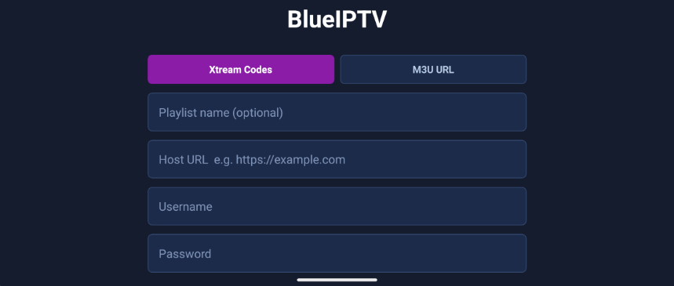

**Playlists.** Several saved providers, one active at a time.

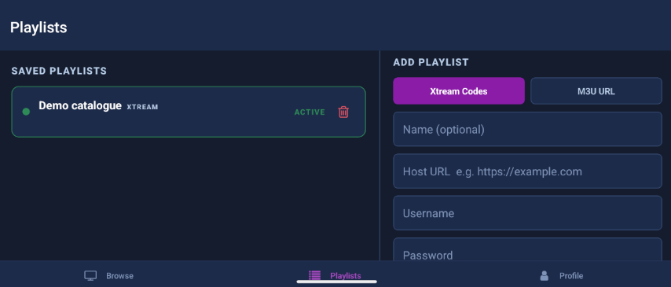

**Movies**, and a movie's detail sheet with lazily-fetched metadata.

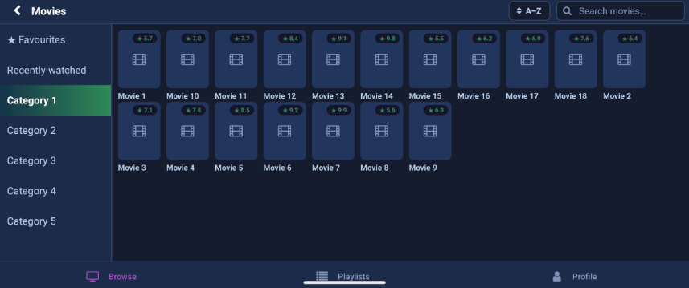
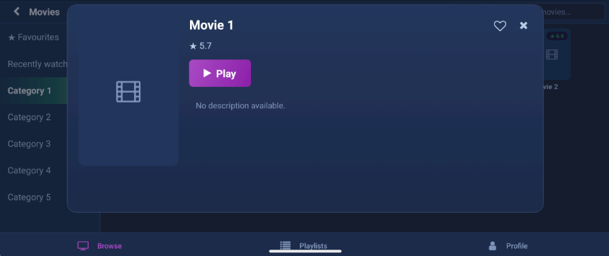

**Series**, and a series detail sheet with its season and episode tree.

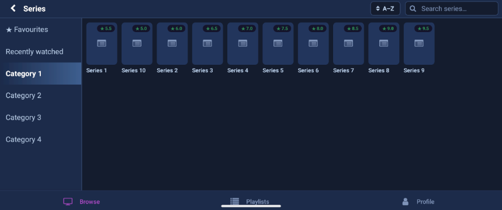
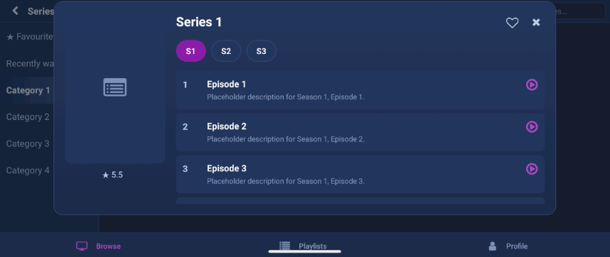

**Catch-Up TV**, per channel and per day.

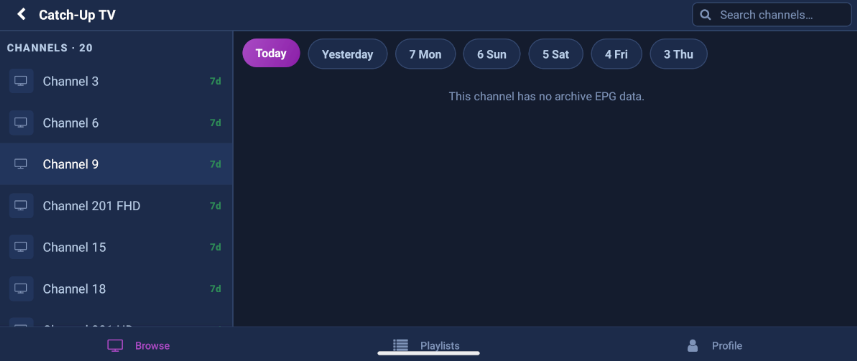

**Profile**, with hidden-category restore and sign-out.

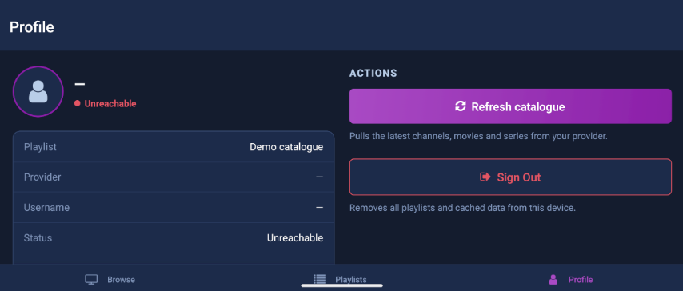

</details>

---

## Architecture

```
┌──────────────────────────────────────────────────────────────┐
│  React Native (Expo SDK 54): landscape Android app           │
│                                                              │
│  ┌────────────┐   ┌──────────────┐   ┌────────────────────┐  │
│  │ Screens    │──▶│ AuthContext  │   │ theme.js           │  │
│  │ (13)       │   │ playlists,   │   │ palette, gradients │  │
│  └─────┬──────┘   │ active id    │   └────────────────────┘  │
│        │          └──────┬───────┘                           │
│        ▼                 ▼                                   │
│  ┌─────────────────────────────────┐  ┌────────────────────┐ │
│  │ services/                       │  │ database/iptv.js   │ │
│  │  xtreamApi · m3u · catalogueSync│─▶│ SQLite, 11 tables  │ │
│  └────────────┬────────────────────┘  │ 8 indexes          │ │
│               │                       │ 46 query helpers   │ │
│               │                       └─────────┬──────────┘ │
│  ┌────────────▼───────────┐   ┌─────────────────▼──────────┐ │
│  │ react-native-vlc-...   │   │ modules/pip (custom Kotlin)│ │
│  │ (patched)              │   │ picture-in-picture         │ │
│  └────────────────────────┘   └────────────────────────────┘ │
└───────────────┬──────────────────────────────────────────────┘
                │  HTTP/HTTPS: player_api.php, .m3u, .ts/.mp4
                ▼
      ┌──────────────────────┐
      │ User's IPTV provider │
      └──────────────────────┘
```

| Layer | Files | Responsibility |
| --- | --- | --- |
| Screens | `screens/*` (13) | Presentation only; all data access through the database layer |
| Navigation | `navigation/AppNavigator.js` | Auth gate, bottom tabs, browse stack; remounts on playlist switch |
| State | `context/AuthContext.js` | Saved playlists, active selection, secure persistence, DB reset on switch |
| Provider I/O | `services/xtreamApi.js`, `services/m3u.js` | HTTP clients, URL construction, response parsing, protocol quirks |
| Orchestration | `services/catalogueSync.js` | Three sync strategies behind one progress-reporting interface |
| Persistence | `database/iptv.js` | Schema, migrations, batched bulk writers, 46 query helpers |
| Native | `modules/pip`, `plugins/`, `patches/` | PiP module, build-time manifest config, upstream library fixes |

Three principles run through it:

**SQLite is the single read path.** No screen ever calls the provider to render a list. The network
is touched only for sync, lazy detail fetches, EPG and the streams themselves. Browsing is instant
and works largely offline.

**Protocol differences are absorbed at the edges.** Xtream builds stream URLs from credentials; M3U
carries a `direct_url` per row. Both normalise into the same tables, so every screen, search,
favourite and sort works identically across protocols.

**The provider is untrusted input.** IPTV panels are inconsistent: base64-encoded EPG text, missing
fields, expired TLS certificates, empty season lists, the same channel listed three times at
different qualities. Parsing is defensive throughout.

---

## Data model

SQLite via `expo-sqlite`: 11 tables, 8 indexes, a versioned schema and self-healing column
migrations.

| Table | Purpose |
| --- | --- |
| `categories` | Category lists per type (`live` / `vod` / `series`) |
| `live_streams` | Channels, EPG channel id, archive flags, optional `direct_url` |
| `vod_streams` | Films, container extension, lazily cached detail JSON |
| `series`, `seasons`, `episodes` | Series tree, populated lazily per series |
| `epg` | Cached programme guide, indexed by channel and time |
| `favourites` | `(item_type, item_id)` across live/vod/series |
| `continue_watching` | Resume positions with duration; drives the Browse rail |
| `hidden_categories` | User-hidden categories, restorable |
| `sync_meta` | Schema version and per-table sync timestamps |

**Migrations repair themselves.** Bumping `SCHEMA_VERSION` drops and rebuilds content tables, but
that flag alone proved insufficient: a failed drop mid-hot-reload could leave the flag reading
"migrated" against an old table. `initDb` now also inspects `PRAGMA table_info` and adds missing
columns via `ALTER TABLE`, so the database recovers regardless of how it got into a bad state.

**Quality-variant grouping.** Providers commonly list "Sky Sports HD", "Sky Sports FHD" and
"Sky Sports SD" as three channels. `utils/liveVariants.js` normalises names, groups duplicates into
one logical channel and exposes the variants for in-player quality switching, collapsing a
20,000-row list into something browsable.

---

## Performance engineering

Two measured problems, both fixed at the root.

**Catalogue writes were blocking the JS thread.** Sync inserted row by row, one JS↔native
round-trip per row, over 40,000 blocking calls on a large provider, freezing the UI for about
53 seconds. It surfaced as React Native's `VirtualizedList` slow-update warning with `dt: 53673`.
Rewritten to batch rows into multi-`VALUES` statements sized to stay under SQLite's bound-parameter
limit (`floor(900 / columnsPerRow)`, so roughly 80–100 rows per statement and ~250 calls total),
yielding to the event loop between batches. Applied across categories, channels, movies, series,
seasons and episodes.

**List rendering.** Channel rows and poster cards were inline closures, so every item re-rendered on
any parent state change. Fixed with `React.memo`, ref-backed stable callbacks, fixed row heights
with `getItemLayout`, `removeClippedSubviews` and tuned batch sizes.

**Pagination.** Category opens fetched 500 rows when about 30 were visible. Reduced to a 60-item
first page and 200-item pages on scroll, backed by composite `(category_id, name)` indexes so
paging neither rescans nor re-sorts.

---

## Native work

**Custom Expo module, `modules/pip`** (142 lines of Kotlin). Expo provides no picture-in-picture
API, so this exposes one: `enterPip(isPlaying)`, `updatePipActions(isPlaying)`, `isSupported()`.
Activity APIs are marshalled onto the UI thread, because calling them from Expo's module queue
throws and terminates the app. The PiP window's play/pause button is a `RemoteAction` backed by a
`PendingIntent`; taps arrive as a broadcast, are forwarded to JS as an `onPipAction` event, and the
updated params are pushed back so the icon flips. API-level and OEM capability checks degrade
gracefully rather than throwing.

**Config plugin, `plugins/with-vlc-media-player.js`.** Injects manifest configuration at prebuild
time: cleartext traffic (most IPTV panels are plain HTTP), the Google Cast options provider
(replacing a community plugin pinned to an incompatible Expo version), PiP flags, resizeable
activity, and the config-change list PiP requires.

**Upstream patches, `patches/react-native-vlc-media-player+1.0.98.patch`.** One patch file, two
fixes, across three library source files:

1. *Subtitle delay API.* The library exposes no subtitle timing control. The patch threads a
   `subtitleDelay` prop through the view manager to `IVLCVout`'s `setSpuDelay`.
2. *Crash fix.* `onHostPause` called `pause()` on a released native player, throwing
   `IllegalStateException: can't get VLCObject instance` and killing the process every time the
   activity paused, reproducible on every entry into picture-in-picture. Patched to check
   `isReleased()` and catch failures, in both `onHostPause` and `onHostResume`.

That second one produced no JavaScript error and no obvious native trace, only
`ActivityTaskManager: Pinned task is removed`. It was isolated by capturing full `adb logcat` output
and locating the `AndroidRuntime` frame, which pointed at library code rather than application code.

---

## Resilience

IPTV providers are unreliable, and the app assumes it:

- **Scheme fallback.** Any failed request is retried once over the opposite scheme (`https`↔`http`).
  Panels are routinely served with expired certificates, and a browser lets you click through
  where `fetch` cannot, so this turns a hard failure into a working connection.
- **User-agent spoofing.** Some panels reject React Native's default user-agent; requests identify
  as VLC.
- **Actionable errors.** "Network request failed" is replaced with the actual cause and a next step:
  expired certificate, timeout, wrong credentials, expired subscription.
- **Stream fallbacks.** HLS→TS for live, two automatic reconnects, per-programme archive
  availability checks.
- **Defensive parsing.** Base64-or-plaintext EPG fields, missing artwork, empty seasons filtered
  out, malformed M3U entries skipped.

---

## Security and privacy

- Provider credentials live in **`expo-secure-store`** (Android Keystore), never plain
  `AsyncStorage`.
- **No backend, no telemetry, no accounts.** Credentials travel only to the user's own provider.
  There is no third-party server that could leak them.
- Legacy keys from the previous backend-based build are actively deleted on launch.
- Sign-out clears credentials *and* wipes the cached catalogue, so a shared device does not leak the
  previous user's content.

**This repository contains no credentials, no API keys and no provider URLs.** The app ships with no
sources of any kind. It is a client: without your own subscription or playlist it does nothing, in
the same way VLC does nothing without a file.

---

## Demo mode

Every screenshot above was taken against a built-in demo catalogue rather than a real subscription,
which is also how the app can be explored and manually tested without a provider.

Selecting **"Explore with a demo catalogue"** on the login screen seeds a synthetic catalogue with
neutral placeholder names: 6 live categories and 60 channels, 90 movies, 40 series with seasons and
episodes, a programme guide, favourites, and part-watched items.

It writes through the *same* bulk writers the real sync uses, so every screen renders from genuine
SQLite reads rather than mocked component state. The demo exercises the real code path, not a
parallel one.

See [`DEMO_MODE.md`](DEMO_MODE.md) for how it is wired.

---

## Architectural evolution

The project began as a college assignment with a conventional three-tier architecture: React Native
client, Express + Mongoose backend, MongoDB, JWT auth, S3 profile photos, Stripe billing with trial
periods.

It was deliberately re-architected to be backend-free, because:

- The backend's only unique job was storing IPTV credentials encrypted at rest, duplicating what the
  device could hold securely itself.
- It sat outside the streaming path entirely, so removing it cost no functionality.
- It removed a server, a database, an object store, a payment integration, recurring hosting costs
  and an entire class of security liability.
- It matches how established players (TiviMate, IPTV Smarters) actually work: users bring their own
  provider.

Removed: Express service, MongoDB models, JWT middleware, AES-256-GCM credential vault, S3 uploads,
Stripe checkout and trial logic. Replacing it: `expo-secure-store` and a multi-playlist model in
React context.

This is documented because the decision is the interesting part. The most defensible version of a
system can be the one with a whole tier deleted.

---

## Known limitations

Stated plainly rather than hidden:

- **M3U playlists** carry no series structure, plot or rating metadata, EPG or catch-up. The format
  does not provide it. Xtream playlists get the full feature set.
- **Chromecast** cannot decode raw MPEG-TS, so many live channels will not cast even though movies
  and HLS channels will. Screen mirroring is the practical fallback.
- **Picture-in-picture** works but is untidy on some OEM ROMs; surface handling across the
  transition needs further work.
- **iOS is untested.** The dependency set is cross-platform and the config plugin has an iOS path,
  but no iOS build has been validated.
- **Favourites and watch progress are device-local** and are cleared when switching playlists, since
  provider ID spaces differ.
- **No automated test suite.** Verification has been manual plus static parse checks in CI.

---

## Build and run

```bash
npm install                     # postinstall applies patches via patch-package
npx expo prebuild --clean       # regenerates android/ from app.json + plugins
npx expo run:android -d         # build, install and run on a connected device
```

**Requirements:** Node 18+, JDK 17, Android SDK, a device or emulator on API 26+ (minSdk 26 for
libVLC). Expo Go is not supported; the custom native module and libVLC need a development build.

On first launch, add a playlist (Xtream host, username and password, or an M3U URL), then run a
catalogue sync. Or tap **Explore with a demo catalogue** to skip that entirely.

**Release APK:**

```bash
cd android && ./gradlew assembleRelease -PreactNativeArchitectures=arm64-v8a
```

Single-architecture builds are around 90 MB against roughly 250 MB universal, since libVLC ships a
large set of decoders per ABI.

---

## Technology summary

| Area | Choice |
| --- | --- |
| Framework | React Native 0.81 / Expo SDK 54, React 19 |
| Language | JavaScript (app), Kotlin (native module), Java (library patches) |
| Navigation | React Navigation 7, bottom tabs and native stack |
| Storage | `expo-sqlite` (catalogue), `expo-secure-store` (credentials) |
| Playback | `react-native-vlc-media-player` (libVLC), patched |
| Casting | `react-native-google-cast` |
| UI | `expo-linear-gradient`, `@expo/vector-icons`, custom theme |
| Native tooling | Custom Expo module, Expo config plugin, `patch-package` |
| Protocols | Xtream Codes API, M3U/M3U8, XMLTV-derived EPG, HLS/MPEG-TS |
| CI | GitHub Actions: install, patch application, static parse check |
| Build | Gradle, Expo prebuild |

---

## Repository layout

```
App.js, index.js       Entry point and root navigation
theme.js               Palette, gradients, shared styling
components/            AuthForm, SearchBar, MarqueeText
context/AuthContext.js Saved playlists, active selection, secure persistence
database/iptv.js       SQLite schema, migrations, batched writers, 46 query helpers
navigation/            Auth gate, tabs, browse stack
screens/               13 screens
services/              Xtream API client, M3U parser, catalogue sync, demo catalogue
utils/                 Quality-variant grouping, EPG text decoding
modules/pip/           Custom Kotlin native module, picture-in-picture
plugins/               Expo config plugin, manifest configuration
patches/               Upstream libVLC wrapper fixes
docs/screenshots/      Screenshots used in this README
```

---

## Author

Cathal Hardy, BEng (Hons) Software & Electronic Engineering, Atlantic Technological University

## Licence

MIT. See [LICENSE](LICENSE).
